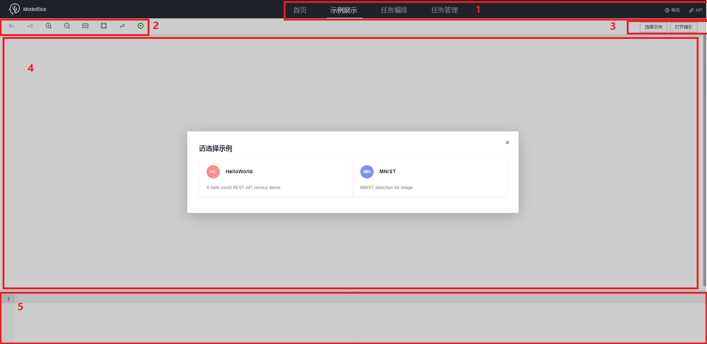
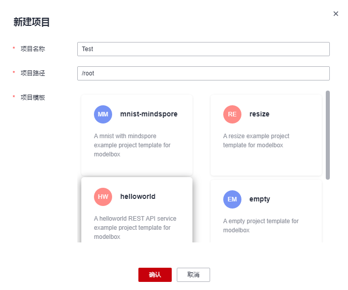
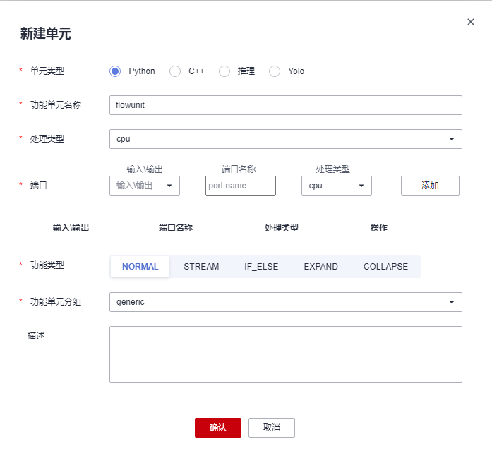
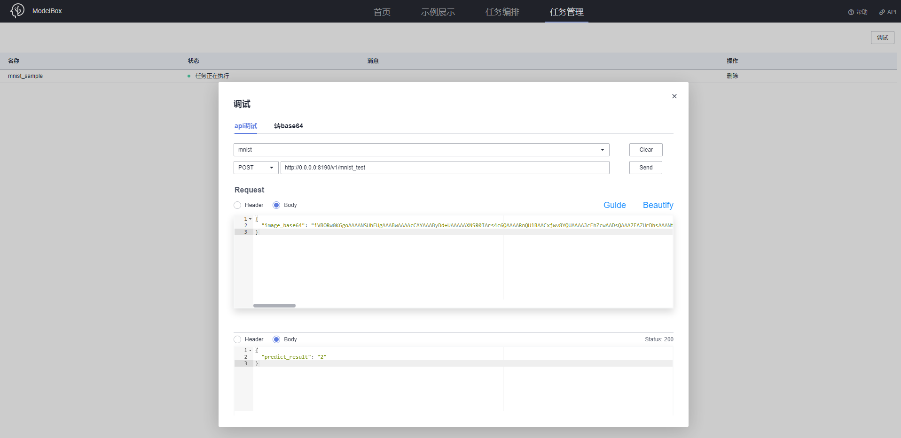

# 可视化编排服务

ModelBox提供了在线可视化编排的工具——Editor，在开发时，可使用此工具，提升开发效率。

## 编排服务是什么

编排服务是用来在Editor可视化界面上，编排[流程图](../use-modelbox/modelbox-app-mode/flow/flow.md)并自动生成相对应的[图](../basic-conception/graph.md)代码的快速开发工具。

## 编排服务开发使用流程


1. 安装ModelBox server服务。
1. 配置ModelBox Server。
1. 配置启用编排服务。
1. 浏览器访问Editor界面。
1. 业务进行编排操作。
1. 下发编排任务。

编排服务集成在ModelBox Server中，默认情况下，编排服务未启用。可以参考下方[编排服务配置](./editor.md#编排服务配置)章节来启用编排服务并加载Editor界面。

## 编排服务配置

ModelBox Server安装完成后，编排服务会通过插件的形式由ModelBox Server加载，并在网页浏览器上提供在线可视化编排服务。

对应插件路径为`"/usr/local/lib/modelbox-plugin-editor.so"`(#由于不同操作系统目录结构存在差异，此路径也可能为 `"/usr/local/lib64/modelbox-plugin-editor.so"`，下文涉及系统lib库路径的地方均存在系统路径差异)。

编排服务插件的配置文件路径为`/root/modelbox-service/conf/modelbox.conf`，其配置项目如下：

| 配置项目               | 配置说明                                                                    |
| ---------------------- | --------------------------------------------------------------------------- |
| editor.enable          | 是否启用Editor工具                                                          |
| editor.ip              | Editor工具监听IP，默认为127.0.0.1。不指定的情况下，和server.ip一致          |
| editor.port            | Editor工具监听端口，默认为1104，不指定情况下，和server.port一致             |
| editor.root            | Editor前端UI路径，默认为/usr/local/share/modelbox/www                       |
| editor.demo_root       | Editor demo路径，默认为/usr/local/share/modelbox/demo |

下面分别介绍两种启用Editor的方法。

### 命令行启用Editor

通过如下命令，可开启基于Web的可视化编辑工具——Editor。

```shell
modelbox-tool develop -s 
```

命令执行后，将在用户/root/modelbox-service创建运行目录，并开启http编排服务，可使用对应主机的IP地址，和开启的端口号（默认端口号为1104），在[配置ACL](./editor.md#访问控制列表)并重启modelbox服务使之生效后，即可访问Editor界面。

### 配置启用Editor

若需要定制化编排服务启动参数，可以修改配置文件，具体修改流程如下：

1. 打开`/root/modelbox-service/conf/modelbox.conf`，修改其中的配置项：

```shell
[server]
ip = "0.0.0.0"
port = "1104"
flow_path = "/root/modelbox-service/graph"

[plugin]
files = [
    "/usr/local/lib/modelbox-plugin.so",
    "/usr/local/lib/modelbox-plugin-editor.so"
]

[control]
enable = true
listen = "/root/modelbox-service/run/modelbox.sock"

[acl]
allow = [
    "127.0.0.1/8",
    # ADD CLIENT HOST HERE
    "192.168.59.145"
]

[editor]
enable = true
# ip = "127.0.0.1"
# port = "1104"
root = "/usr/local/share/modelbox/www"
demo_root = "/usr/local/share/modelbox/demo"

[log]
# log level, DEBUG, INFO, NOTICE, WARN, ERROR, FATAL, OFF
level = "INFO"

# log archive number
num = 32

# log file path
path = "/root/modelbox-service/log/modelbox.log"
```

1. 重启ModelBox Server服务使配置生效。

   ```shell
   /root/modelbox-service/modelbox restart
   ```

   或者

   ```shell
   /root/modelbox-service/modelbox-manager restart
   ```

### 访问控制列表

访问控制列表ACL（Access Control List）是由一条或多条规则组成的集合，里面配置了允许访问Editor的IP地址。
可以通过修改配置文件，来修改ACL列表，具体流程如下：

1. 打开`$HOME/modelbox/modelbox.conf`，修改其中的配置项：
   假设打开编排UI的机器的IP地址为10.11.12.13

   ```shell
    [acl]
    allow = [
        "10.11.12.13",
    ]
   ```

    如果没有配置任何访问白名单，则允许所有人皆可访问。

    ```shell
       # [acl]
       # allow = [
       #     "10.11.12.13",
       # ]
    ```

1. 重启ModelBox Server服务使配置生效。

## 访问编排服务

服务启动成功后，可使用浏览器访问服务，输入对应的网址即可，如：`http://[host]:1104/editor/`，成功后，将显示如下界面：


在主页中，分别可以链接到《示例展示》，《任务编排》，《任务管理》。右上角可以可查看《帮助文档》以及《API》。

### 示例展示



该页面分为5个功能区域，其对应的功能如下：

1. 区域1，导航页面。
2. 区域2，基本编排操作区域，包含对6号区域的放大，缩小，重置大小，居中显示，垂直/水平显示，运行图。
3. 区域3，示例相关功能，可以选择示例以及打开指引。
4. 区域4，图形化编排界面，使用鼠标可以控制组件链接和移动。`Ctrl+鼠标左键`可以拖动画布。
5. 区域5，对应文本化编排界面，可使用标准的[DOT](https://www.graphviz.org/pdf/dotguide.pdf)语法进行文本编辑。


成功加载所选示例，并点击图中节点时，将显示右侧配置面板。可根据自己的需求对各个节点进行配置。

配置完成后，即可点击区域2中的“运行”按钮，将下发编排任务，并自动跳转至任务管理页面查看任务状态。

快捷键说明：

1. 放大缩小：`鼠标滚轮`，或键盘，`-`，`=`按键。
2. 全选：`ctrl+a`
3. 撤销：`ctrl+z`
4. 重做：`ctrl+u`
5. 取消选择：`escape`

注意事项：

1. 对应网址的端口号以docker启动脚本中的 `EDITOR_MAP_PORT` 为准，默认端口号为1104。

## 任务编排页面


该页面是进行图编排、设置的主要界面。

### 功能说明

进入界面后，即可点击`项目`来新建或者打开一个项目。
随后，可以通过`拖拽至编排界面`或者`双击`左侧功能单元列表上所需要的功能单元，将功能单元显示在编排界面上。
如果需要自定义新的功能单元，可以点击`功能单元`来创建。
当图编排完成之后，可以通过`图属性`设置相关属性。最后，点击`项目`下面的`保存`即可将项目信息保存至后端。
如果需要运行项目，就点击工具栏上的`运行`按钮即可。

#### 项目

`项目`下拉菜单在工具栏的左侧的第一个位置，其有四个功能，分别为：

1. 新建项目

依次输入项目名称以及项目路径，并选择相对应的项目模板，点击确认即可创建一个新的项目。项目路径如果不存在，将会自动创建。



2. 打开项目

输入项目路径，点击`确认`即可打开项目。


3. 保存

将更改的内容保存至后端。

4. 关闭

将会清空保存在浏览器中的项目数据。

#### 功能单元

1. 新建单元



依次选择功能单元类型，名称，处理类型。

端口可通过选择`输入\输出`，`端口名称`，`处理类型`，点击`添加`来增加功能单元的端口。

再选择功能类型。功能类型相关的介绍可以参考[功能单元开发](../use-modelbox/modelbox-app-mode/flowunit/flowunit.md)。

1. 刷新单元

如果在后端对功能单元进行了更改，可用该功能直接加载更新后的功能

## 任务管理页面



该页面除了可以查看运行中的任务状态，还可以对任务进行调试。

调试功能有：`api调试`与`转base64`

### api调试

选择相关模板， 修改Request中的Header和Body部分，发送请求之后得到的Reponse将显示在页面上。

也可以不加载模板，直接进行调试。

### 转base64

选择需要转成base64格式的文件，即可在页面右侧得到base64代码。
